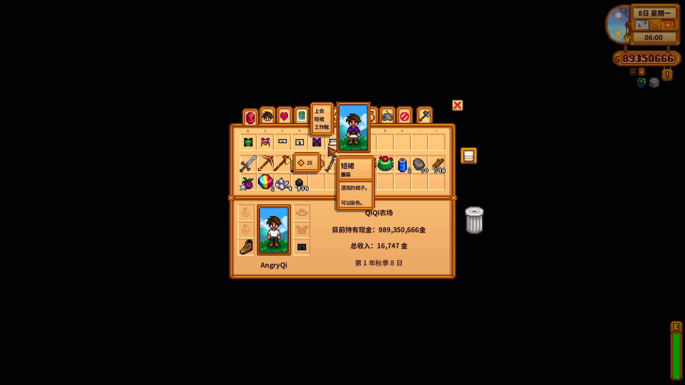
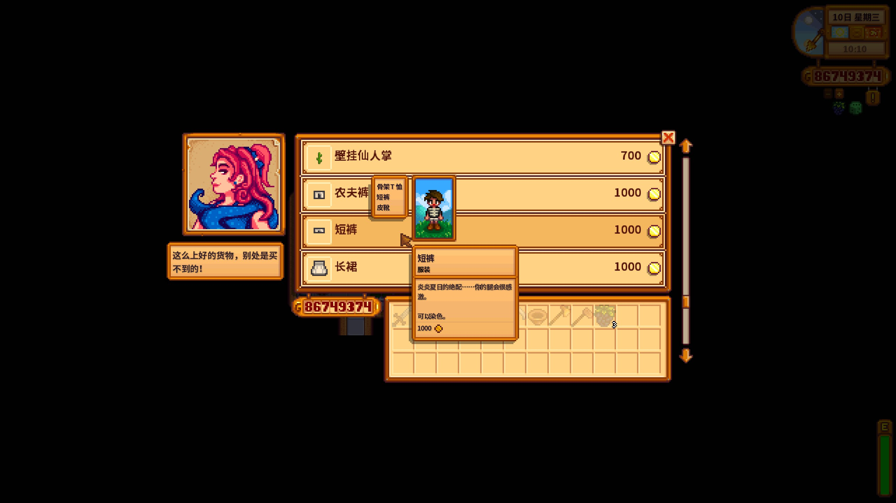
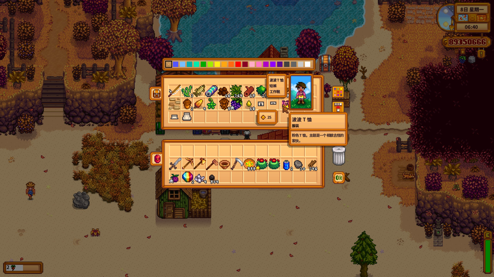
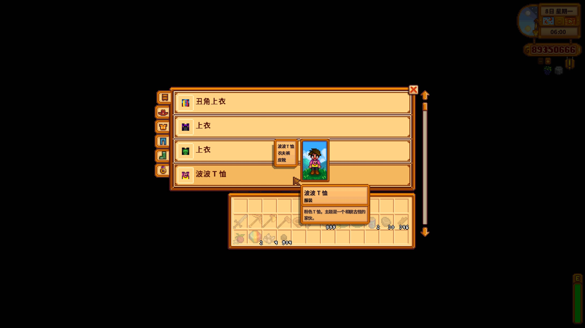

# OutfitPreview

[](README_EN.md)

星露谷物语模组 — 在菜单中悬停服饰物品时，实时预览角色穿戴效果。

## 功能

在以下界面中，将鼠标悬停到服饰物品（帽子、上衣、裤子、鞋子）上，即可在光标旁看到角色穿戴该物品的实时预览，同时显示当前已装备的所有服饰名称：

- **物品栏** — 玩家背包中的服饰物品
- **商店** — 商店中出售的服饰物品
- **箱子** — 箱子中的服饰物品
- **梳妆台** — 梳妆台中的服饰物品

### 预览行为

- 打开上述任一页面时，预览形象初始为**当前角色的实际外观**。
- 在不关闭页面的情况下，**上一次预览的服饰种类会保留**。例如先悬停一件上衣、再悬停一顶帽子，预览角色会同时穿着这件上衣和这顶帽子。
- 关闭页面后预览面板自动消失。

## 效果展示

| 物品栏 | 商店 |
|--------|------|
|  |  |

| 箱子 | 梳妆台 |
|------|--------|
|  |  |

## 安装

1. 安装 [SMAPI](https://smapi.io/)（最低版本 4.0.0）
2. 下载本模组最新版本
3. 将解压后的 `OutfitPreview` 文件夹放入星露谷物语的 `Mods` 目录
4. 启动游戏

## 构建

```bash
# 要求 .NET 6.0 SDK
dotnet build                  # Debug
dotnet build -c Release       # Release
```

构建成功后，`Pathoschild.Stardew.ModBuildConfig` 会自动将输出文件复制到 `Mods/OutfitPreview/`。

## 兼容性

- 星露谷物语 1.6+
- SMAPI 4.0.0+
- 平台：Windows / macOS / Linux

## 致谢

- [SMAPI](https://github.com/Pathoschild/SMAPI) — 星露谷物语模组框架
- [Stardew Valley](https://www.stardewvalley.net/) — ConcernedApe

## 许可证

本项目仅供个人学习使用。
