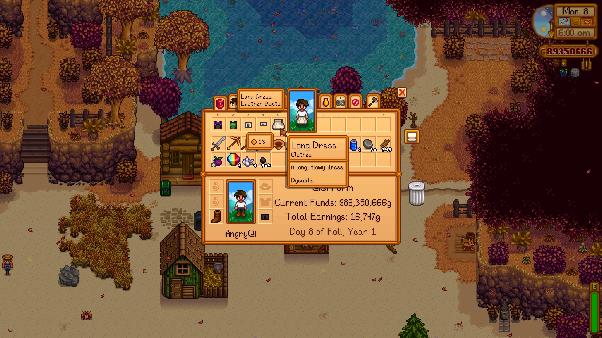
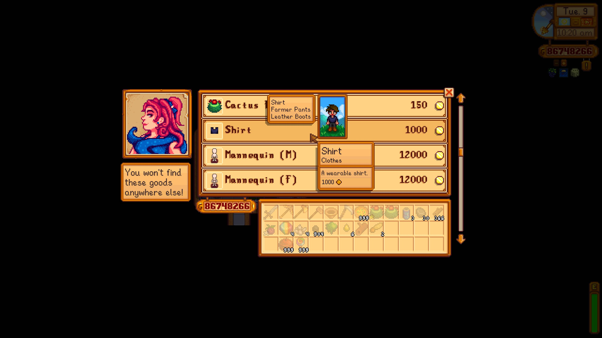
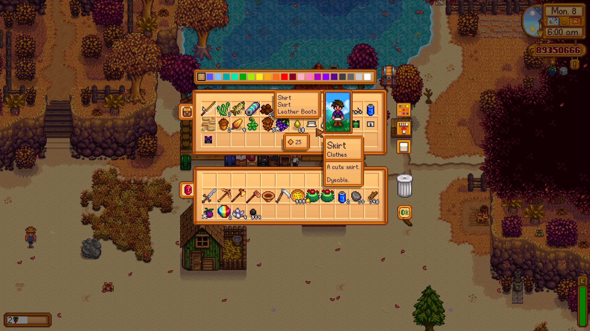
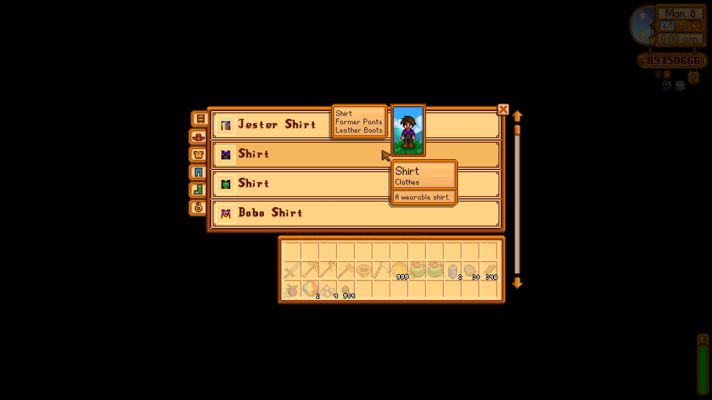

# OutfitPreview

[](README.md)

A Stardew Valley mod that renders a live preview of your farmer wearing an outfit item when you hover over it in supported menus.

## Features

Hover over clothing items (hats, shirts, pants, boots) in the following screens to see a real-time preview of your farmer wearing that item next to your cursor, along with a tooltip listing all currently equipped outfit pieces:

- **Inventory** — clothing items in your backpack
- **Shop** — clothing items sold in shops
- **Chest** — clothing items stored in chests
- **Dresser** — clothing items stored in dressers

### Preview Behavior

- When opening any of the above screens, the preview starts with your **farmer's current actual appearance**.
- While the screen stays open, **previously previewed outfit types are retained**. For example, hovering over a shirt and then a hat will show the preview farmer wearing both the shirt and hat.
- The preview panel disappears when you close the screen.

## Screenshots

| Inventory | Shop |
|-----------|------|
|  |  |

| Chest | Dresser |
|-------|---------|
|  |  |

## Installation

1. Install [SMAPI](https://smapi.io/) (minimum version 4.0.0)
2. Download the latest release of this mod
3. Extract the `OutfitPreview` folder into your Stardew Valley `Mods` directory
4. Launch the game

## Build

```bash
# Requires .NET 6.0 SDK
dotnet build                  # Debug
dotnet build -c Release       # Release
```

After a successful build, `Pathoschild.Stardew.ModBuildConfig` automatically copies the output files to `Mods/OutfitPreview/`.

Pushing a `v*` tag triggers the CI workflow to build and publish a GitHub Release (and optionally upload to Nexus Mods if configured).

## Compatibility

- Stardew Valley 1.6+
- SMAPI 4.0.0+
- Platform: Windows / macOS / Linux

## Credits

- [SMAPI](https://github.com/Pathoschild/SMAPI) — Stardew Valley modding framework
- [Stardew Valley](https://www.stardewvalley.net/) — ConcernedApe

## License

This project is for personal learning purposes only.
